# 로컬 개발 환경 구성

## 목차
- [로컬 개발 환경 구성](#로컬-개발-환경-구성)
  - [목차](#목차)
  - [작업 디렉토리 생성](#작업-디렉토리-생성)
  - [NotePad++ 설치(Windows Only)](#notepad-설치windows-only)
  - [MobaXTerm 설치(Windows Only)](#mobaxterm-설치windows-only)
  - [로컬 ubuntu 설치](#로컬-ubuntu-설치)
  - [JDK 설치](#jdk-설치)
  - [IntelliJ 설치](#intellij-설치)
  - [Docker 설치](#docker-설치)
  - [Microsoft Visual Studio Code 설치](#microsoft-visual-studio-code-설치)
  - [Git Client 설치](#git-client-설치)
  - [Node.js 설치](#nodejs-설치)
  - [DBeaver 설치](#dbeaver-설치)
  - [GitHub 회원가입 및 토큰 생성](#github-회원가입-및-토큰-생성)
  - [Docker HUB 회원가입](#docker-hub-회원가입)
---

## 작업 디렉토리 생성
{사용자 홈}하위에 'home/workspace'로 만듭니다.    
Windows는 Power Shell에서 만듭니다.  
  

Mac은 Terminal에서 아래 명령으로 만듭니다.  
```
mkdir -p ~/home/workspace
```

## NotePad++ 설치(Windows Only) 
**Notepad++** 은 편집기 프로그램입니다.  

설치 목적은 로컬에서 문서를 작성하거나 편집하기 위해서입니다.  
또한 MobaXTerm이라는 터미널 프로그램으로 서버에 접속한 후 서버의 파일을   
이 프로그램을 이용하여 마치 로컬인것처럼 편하게 편집할 수 있습니다.   
- 설치 사이트 접근: [Notepad++ 설치 페이지](https://notepad-plus-plus.org/downloads/)로 접근합니다.  
- 제일 위에 있는 최신 버전을 클릭합니다.  
- 'Download Notepad++ x64'의 'Installer'를 클릭합니다.  
- 설치 실행파일(exe)을 다운로드 합니다.  
- 다운로드한 설치파일을 실행하여 설치합니다.  
> **💡 Tip**   
> 설치 시 바꾸지 말고 기본값을 그대로 사용해 주세요. 
> - 설치위치: 바꾸셔도 되는데 디폴트값을 그대로 쓰세요. 
> - 구성요소 선택: 기본값 그대로 두고 '다음'누르세요. 

| [Top](#목차) |

---

## MobaXTerm 설치(Windows Only)
**MobaXTerm**은 Putty와 같은 터미널 프로그램입니다.  
MobaXTerm을 쓰는 이유는 첫째 Window에서도 Linux명령을 사용하기 위해서고,  
둘째 서버 접속 후 서버의 파일을 쉽게 편집하기 위해서입니다.  

**1)설치하기** 
- 사이트 접근  
[다운로드 페이지](http://mobaxterm.mobatek.net/download.html)를 접근합니다.  
- 설치파일 다운로드
Home Edition 아래에 있는 [Download now]를 클릭합니다.   
그 다음 페이지에서 'Installer edition'을 클릭합니다.    

> **💡 Tip**   
> - Installer edition: 설치파일을 다운로드하여 설치할 때 선택   
> - Portable edition:  압축파일을 다운로드하여 해지한 후 바로 사용할 때 선택   
   
- 압축된 설치파일을 아무 디렉토리나 풉니다.   
- 설치파일을 실행하여 설치 합니다. 

> **💡 Tip** 
> 설치할 디렉토리는 바꾸셔도 되는데 기본 위치에 설치하세요. 

- MobaXTerm 실행
설치가 된 디렉토리(예:C:\Program Files (x86)\Mobatek) 하위의  
'MobaXterm'디렉토리로 이동한 후, MobaXterm.exe파일을 실행 합니다.   
  
- 작업표시줄에 고정 
자주 사용할 프로그램이므로 작업표시줄에 고정시킵니다.   
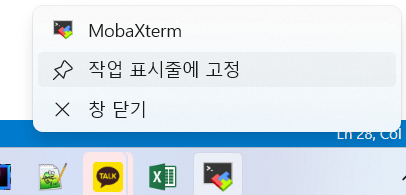  

**2)설정하기** 
  
- 영구저장 디렉토리 설정  
MobaXTerm은 저장소로 임시공간을 사용합니다.  
즉, 종료를 하면 데이터가 전부 사라집니다.  
따라서, 반드시 이 설정을 해서 소중한 데이터가 없어지지 않게 하세요.  
  

> **설정**   
> - Persistent home directory: 'C:\home' 선택   
> - Persistent root (/) directory: 'C:\home' 선택. 선택 후 뒤에 'slash'붙는건 정상임  
> - Default text editor program: 'C:\Program Files\Notepad++\notepad++.exe' 선택  

  

| [Top](#목차) |

---

## 로컬 ubuntu 설치    
Ubuntu를 설치하여 Window에서 Linux 명령을 사용하도록 설정합니다. 

**1)설치하기**
- Powershell을 관리자 권한으로 실행   
  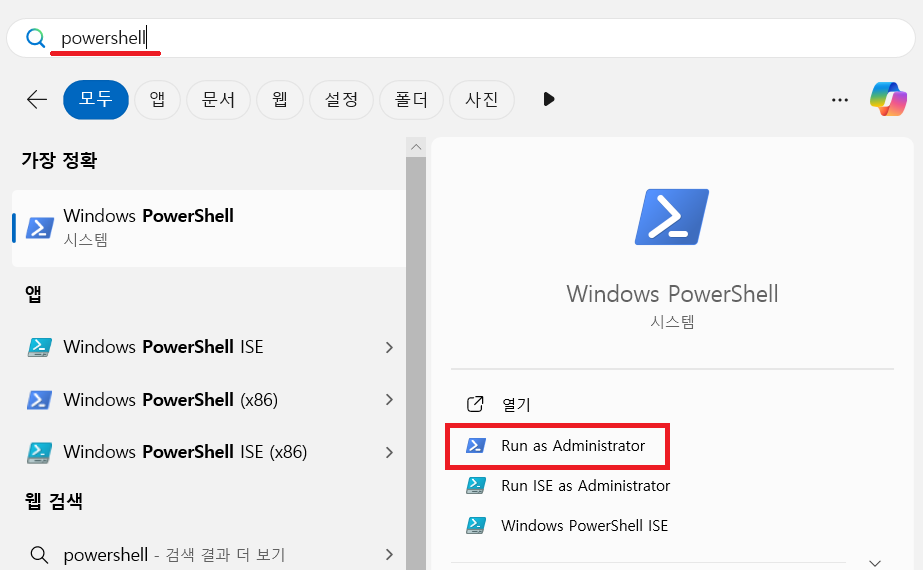  

- WSL(Window Subsystem for Linux) 업그레이드  
  WSL은 Window에서 Linux를 사용할 수 있게 해주는 툴입니다.  
  기본적으로 WSL 버전1이 설치되어 있습니다.  
  이를 가상화 기술이 추가된 WSL2로 업그레이드 해야 합니다.    
  
  현재 WSL의 버전을 확인합니다.  아래와 같이 '기본 버전'이 '2'로 나와야 합니다.     
  ```
  C:\Windows\system32> wsl --status
  기본 배포: Ubuntu
  기본 버전: 2
  ``` 

  Case1) WSL 활성화가 안되어 있는 경우  
  만약, 아래와 같이 WSL이 활성화 되어 있지 않다고 나오면 아래 명령으로    
  WSL1을 활성화합니다.  
  ```
  C:\Windows\system32> wsl --status
  WSL 기능이 활성화되지 않았습니다.
  WSL 2를 설치하려면 다음 지침을 따르세요: https://aka.ms/wsl2-install
  ```

  ```
  dism.exe /online /enable-feature /featurename:Microsoft-Windows-Subsystem-Linux /all /norestart
  ```

  Case2) WSL 버전 1인 경우  
  기본 버전이 '2'가 아니면 아래 명령으로 WSL 가상 머신 기능을 활성화 합니다.  
  ```  
  dism.exe /online /enable-feature /featurename:VirtualMachinePlatform /all /norestart
  ```

  Case3) WSL 버전 2인 경우 
  이미 WSL2를 사용중이므로 추가 조치는 필요 없습니다.  
  아래 명령으로 최신 버전으로 업그레이드만 하세요.  
  ```
  wsl --update
  ```

  Case1, Case2인 경우는 아래를 계속 진행해 주세요.   
 
  **PC를 재부팅**합니다.  

  리눅스 커널 업데이트 패키지를 설치 합니다.    
  본인 PC의 CPU 아키텍처에 맞춰 설치파일을 다운로드 합니다.
  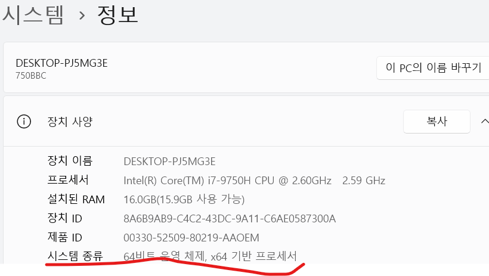  

  x64 : [다운로드](https://wslstorestorage.blob.core.windows.net/wslblob/wsl_update_x64.msi)  
  ARM64 : [다운로드](https://wslstorestorage.blob.core.windows.net/wslblob/wsl_update_arm64.msi)  

  Ubuntu를 설치 합니다.  
  설치 완료 시 까지 Power Shell 화면에서 기다려 주십시오.   
  ```
  wsl --install -d Ubuntu
  ```
  완료 후 ID와 암호를 설정하십시오.  ID는 ubuntu로 해주세요.   

  WSL2를 기본 버전으로 하고 설치된 Linux 배포판을 WSL2로 변환합니다.  
  ```
  wsl --set-default-version 2
  wsl --set-version Ubuntu 2
  ```

  WSL의 버전을 확인합니다.  아래와 같이 기본 배포가 'Ubuntu'이고 '기본 버전'이 '2'로 나와야 합니다.     
  ```
  C:\Windows\system32> wsl --status
  기본 배포: Ubuntu
  기본 버전: 2
  ``` 

  업그레이드까지 합니다.   
  ```
  wsl --update
  ```

- WSL설치 시 Trouble shooting   
  Ubuntu 설치가 완료되지 않거나 다른 어떤 이유로 제대로 수행이 안되는 경우 아래와 같이 재설치를 하세요.   
  
  Power Shell을 관리자 권한으로 실행 합니다.  
  아래와 같이 Ubuntu가 'Running'상태여야 합니다.    

  ```
  wsl -l -v

  NAME              STATE           VERSION
  Ubuntu            Running         2
  docker-desktop    Stopped         2
  ```

  WSL의 버전을 확인합니다.  아래와 같이 기본 배포가 'Ubuntu'이고 '기본 버전'이 '2'로 나와야 합니다.     
  ```
  C:\Windows\system32> wsl --status
  기본 배포: Ubuntu
  기본 버전: 2
  ``` 

  위와 같지 않다면 아래를 시도하여 재설치 하세요.   

  먼저 WSL을 종료합니다:
  ```powershell
  wsl --shutdown
  ```

  Ubuntu를 제거합니다:
  ```powershell
  wsl --unregister Ubuntu
  ```

  Ubuntu를 다시 설치합니다:
  ```powershell
  wsl --install Ubuntu
  ```

  완료 후 ID와 암호를 설정하십시오.  ID는 ubuntu로 해주세요.     

  WSL2를 기본 버전으로 하고 설치된 Linux 배포판을 WSL2로 변환합니다.  
  ```
  wsl --set-default-version 2
  wsl --set-version Ubuntu 2
  ```

  WSL의 버전을 확인합니다.  아래와 같이 기본 배포가 'Ubuntu'이고 '기본 버전'이 '2'로 나와야 합니다.     
  ```
  C:\Windows\system32> wsl --status
  기본 배포: Ubuntu
  기본 버전: 2
  ``` 

  업그레이드까지 합니다.   
  ```
  wsl --update
  ```

- WSL세션 작성 및 로그인  
  
  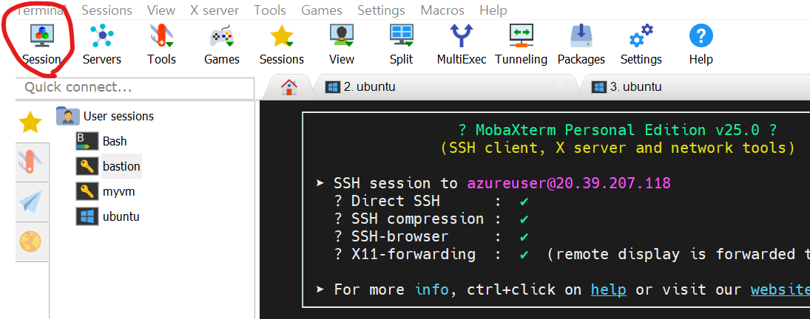  

  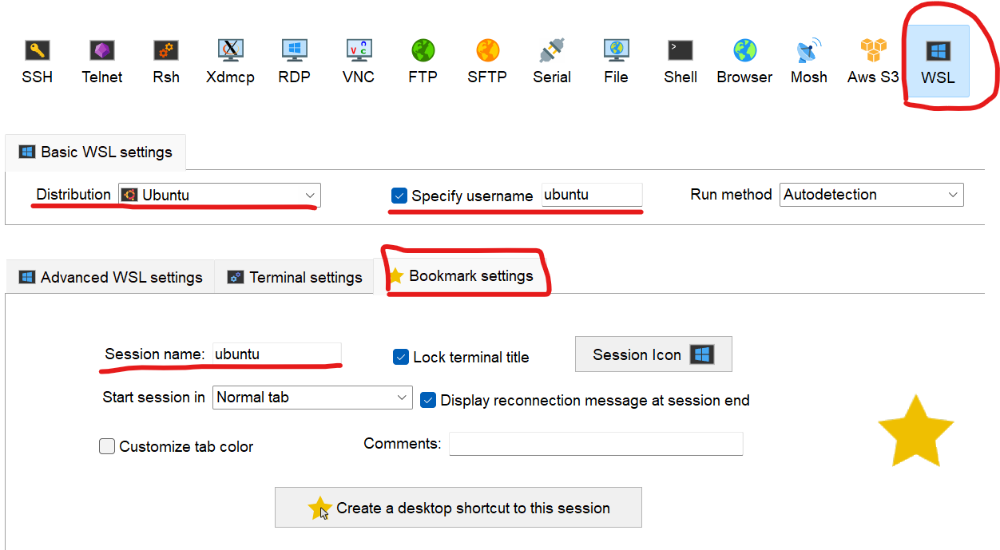  
  
  작성한 WSL세션을 클릭하여 로그인합니다.  
  **이후 작업은 모두 로컬 ubuntu에서 수행**합니다.  

- 작업 디렉토리 mount  
  아래 명령 실행 후 workspace 마운트 설정 추가 
  ```
  sudo vi /etc/fstab

  /mnt/c/home/workspace /home/ubuntu/workspace none bind 0 0
  ``` 
  > Tip: vi 사용이 힘들면 기본 에디터로 열어 수정 하십시오.    

  ```
  mkdir ~/workspace

  sudo systemctl daemon-reload
  sudo mount -a 

  ll ~
  ```

**2)필요 툴 설치** 

- Azure CLI 설치    
  ```
  # 1. Microsoft 서명 키 추가
  curl -sL https://packages.microsoft.com/keys/microsoft.asc | gpg --dearmor | sudo tee /etc/apt/trusted.gpg.d/microsoft.gpg > /dev/null

  # 2. Azure CLI 저장소 추가
  AZ_REPO=$(lsb_release -cs)
  echo "deb [arch=amd64] https://packages.microsoft.com/repos/azure-cli/ $AZ_REPO main" | sudo tee /etc/apt/sources.list.d/azure-cli.list

  # 3. 패키지 리스트 업데이트 및 설치
  sudo apt-get update
  sudo apt-get install azure-cli
  ```

- Azure Login   
  아래 명령 수행 후 나오는 URL을 브라우저에서 접근하여 URL옆에 있는 코드를 입력하여 로그인 합니다.  
  로그인 후 콘솔로 돌아오면 Subscription선택하는 화면이 나옵니다.  
  Subscription 번호를 입력하여 로그인을 완료 합니다.     
  ```
  az login --use-device-code
  ```
  주의) MobaXTerm에서 수행 시 복사를 위해 CTRL-C를 누르면 수행이 중단됩니다. 드래그만 해도 복사가 됩니다.   

- Azure 전역 설정    
  명령어에서 반복적으로 사용할 Resource Group과 Location값을 기본 설정에 셋팅합니다.   
  Azure resource group을 확인합니다.  
  ```
  az group list -o table
  ```

  ```
  az configure -d group={리소스그룹} location={Location}
  ```
  예시)
  ```
  az configure -d group=tiu-dgga-rg location=koreacentral
  ```

  설정된 값을 확인합니다.
  ```
  az configure -l -o table
  ```

- kubectl 설치 
  ```
  sudo snap install kubectl --classic
  ```

  만약 잘 안되면 아래 명령으로 설치합니다.  
  ```
  sudo apt-get update
  sudo apt-get install -y apt-transport-https ca-certificates curl
  curl -fsSL https://packages.cloud.google.com/apt/doc/apt-key.gpg | sudo gpg --dearmor -o /etc/apt/keyrings/kubernetes-archive-keyring.gpg
  echo "deb [signed-by=/etc/apt/keyrings/kubernetes-archive-keyring.gpg] https://apt.kubernetes.io/ kubernetes-xenial main" | sudo tee /etc/apt/sources.list.d/kubernetes.list
  sudo apt-get update
  sudo apt-get install -y kubectl
  ```
  
  Alias등록 
  ```
  vi ~/.bashrc
  ```

  맨 끝에 alias k=kubectl 추가 

  > **Tip: VI Editor 간단 사용법**  
  > vi editor로 파일을 열면 읽기 모드 상태입니다.  
  > 편집모드로 들어가려면 커서를 편집할 곳으로 옮기고 'i'를 누릅니다.  
  > 파일을 저장하려면 ESC키를 눌러 읽기 모드로 바꾼 후 ':'을 누릅니다.     
  > 저장만 하려면 'w'를 입력하고, 저장 후 닫기를 하려면 'wq'를 입력하고 Enter를 누릅니다.  

  > **TIP: vi editor 대신 기본 에디터 사용하기**   
  좌측 메뉴의 마지막 탭을 누르면 ubuntu 디렉토리가 보입니다.   
  수정할 파일이 있는 디렉토리로 이동하여 파일을 선택하고 우측마우스 메뉴에서 기본 에디터로 파일을 열어 편집하십시오.    
  수정 후 저장하면 자동으로 FTP로 파일이 업로드 됩니다.   
  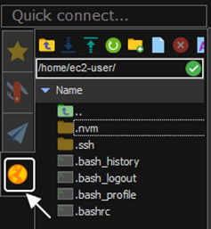  
  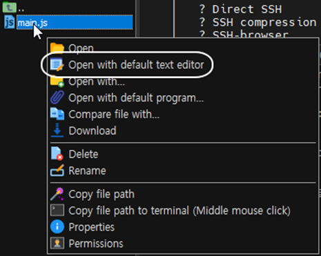  
  
- kubens 설치
  아래 링크에서 소스 복사   
  https://github.com/ahmetb/kubectx/blob/master/kubens

  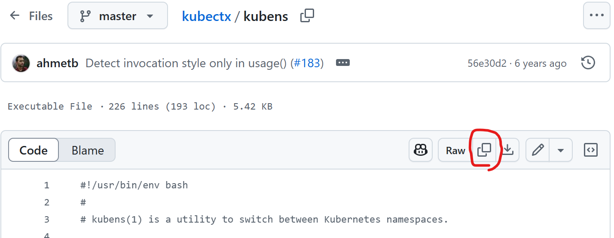  
  
 
  ```
  sudo vi /usr/local/bin/kubens 
  ```
  커서를 맨 위로 올립니다.   
  'ESC'누르고  'i'를 누릅니다.   
  마우스 오른쪽 버튼을 누릅니다.   
  최초에 안내 창 나오는데 마우스 오른쪽 버튼 누를 때 paste 하겠냐는 질문입니다.  
  수락 하시고 다시 안물어보기 체크박스도 체크 해 줍니다.  
  ESC누르고 ':'을 누릅니다.  그리고 'wq'라고 입력하고 엔트를 칩니다.  

  kubens를 실행 파일로 만듭니다.   
  ```
  sudo chmod +x /usr/local/bin/kubens  
  ```

  > Tip: vi 사용이 힘들면 '/usr/local/bin'디렉토리로 이동 후 empty file을 생성하고 기본 에디터로 열어 만드십시오.   

- Docker설치   
  필요한 패키지 설치
  ```
  sudo apt-get update
  sudo apt-get install -y \
      ca-certificates \
      curl \
      gnupg \
      lsb-release
  ```

  Docker GPG key 추가
  ```
  sudo mkdir -p /etc/apt/keyrings
  curl -fsSL https://download.docker.com/linux/ubuntu/gpg | sudo gpg --dearmor -o /etc/apt/keyrings/docker.gpg
  ```

  Docker repository 설정
  ```
  echo \
    "deb [arch=$(dpkg --print-architecture) signed-by=/etc/apt/keyrings/docker.gpg] https://download.docker.com/linux/ubuntu \
    $(lsb_release -cs) stable" | sudo tee /etc/apt/sources.list.d/docker.list > /dev/null
  ```

  Docker 엔진 설치
  ```
  sudo apt-get update
  sudo apt-get install -y docker-ce docker-ce-cli containerd.io docker-compose-plugin
  ```

  현재 사용자를 docker 그룹에 추가 (sudo 없이 docker 명령어 사용 가능)
  ```
  sudo usermod -aG docker $USER
  ```

  Docker 서비스 시작
  ```
  sudo service docker start
  ```

  터미널을 닫고 새 터미널에서 version확인 
  ```
  docker version 
  ```

- buildx 설치   
  buildx는 Docker CLI의 플러그인으로, 컨테이너 이미지 빌드 기능을 확장합니다.  
  설치 안해도 되지만 안하면 Image build 시 경고 메시지가 나와 설치하는게 좋습니다.  

  ```
  wget https://github.com/docker/buildx/releases/download/v0.12.1/buildx-v0.12.1.linux-amd64
  ```

  plugins 디렉토리 생성 및 buildx 설치
  ```bash
  mkdir -p ~/.docker/cli-plugins
  mv buildx-v0.12.1.linux-* ~/.docker/cli-plugins/docker-buildx
  chmod +x ~/.docker/cli-plugins/docker-buildx
  ```

  설치 확인
  ```bash
  docker buildx version
  ```

- helm 설치  
  ```
  mkdir -p ~/install/helm && cd ~/install/helm
  wget https://get.helm.sh/helm-v3.16.4-linux-amd64.tar.gz
  
  tar xvf helm-v3.16.4-linux-amd64.tar.gz
  cd linux-amd64
  sudo cp helm /usr/local/bin

  helm version
  ```

- openjdk 설치  
  ```
  sudo apt-get install -u openjdk-21-jdk

  readlink -f /usr/bin/javac/usr/lib/jvm/java-21-openjdk-amd64/bin/javac
  ```

  profile 오픈 후 맨 끝에 환경변수 추가 
  ```
  sudo vi /etc/profile 
  ```
  
  커서를 맨 아래로 내립니다.   
  ESC 누르고 'i'를 누릅니다.
  아래 내용을 복사하고 우측 마우스 버튼을 눌러 붙여넣기 합니다.   
  ESC를 누르고 ':'을 입력 합니다. 그리고 wq를 누른 후 닫기를 누릅니다.  
   
  ```
  JAVA_HOME=/usr/lib/jvm/java-21-openjdk-amd64
  PATH=$PATH:$JAVA_HOME/bin
  CLASSPATH=$JAVA_HOME/jre/lib:$JAVA_HOME/lib/tools.jar

  export JAVA_HOME PATH CLASSPATH
  ```
  > Tip: vi 사용이 힘들면 기본 에디터로 열어 수정 하십시오.    

  profile 적용 
  ```
  source /etc/profile
  ```

>**Tip**: MobaXTerm에서 **붙여넣기**는 **오른쪽 마우스 버튼**입니다. 

Local Ubuntu 설치와 설정이 모두 끝났습니다.  

| [Top](#목차) |

---

## JDK 설치
1. Mac 사용자
[Mac JDK설치](https://happycloud-lee.tistory.com/186)

2. Windows 사용자  
- JDK 설치 페이지로 접근하여 JDK22 선택: [JDK 설치 다운로드](https://jdk.java.net/)
- 자신의 OS에 맞는 파일을 다운로드: sha256이 아니라 그 옆의 tar.gz 또는 zip클릭   
  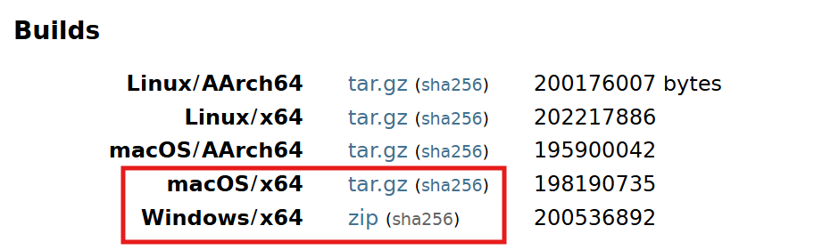  
- 압축해제: 아무 디렉토리에 압축을 해제  
- JDK 설치: 'jdk-22.0.1'디렉토리를 'C드라이브'밑으로 이동하세요  
- JDK 설정  
  - 탐색기를 열고 '내PC'에서 우측마우스 버튼을 눌러 '속성'을 선택    
    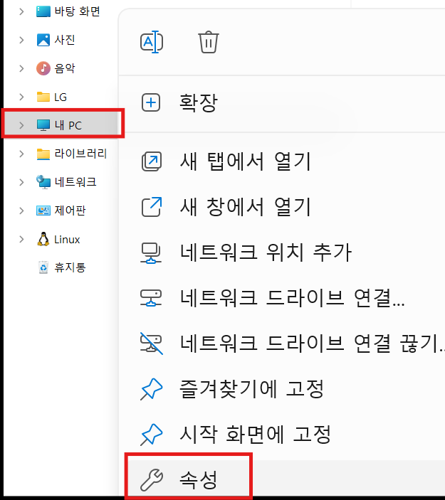  

  - '고급 시스템 설정' 선택   
      

  - JAVA_HOME 환경변수 추가  
    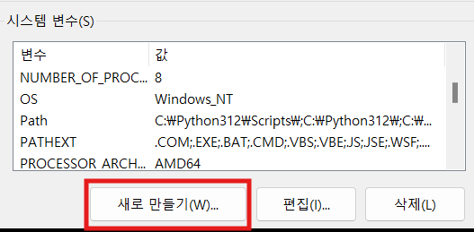  
    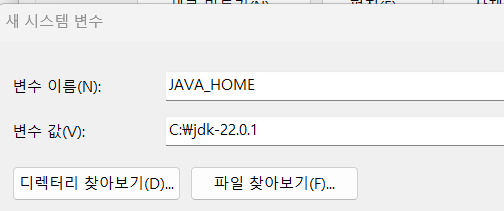    

  - 'Path'환경변수에 Java 실행 디렉토리 경로 추가  
      
    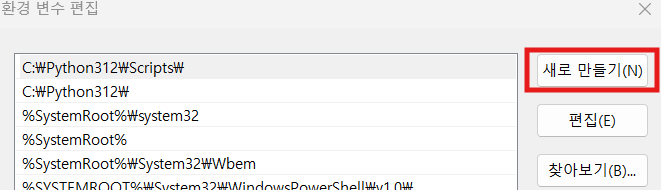  
      

- 설치 확인  
  - MobaXTerm을 실행합니다. 이미 실행중이면 종료 후 재실행 하세요   
  - DOS창을 열어 아래 명령으로 PATH에 추가된 걸 확인 
    ```
    echo $PATH
    ```  
    
  - Java 버전을 확인  
    ```
    java -version 
    ```

| [Top](#목차) |

---
## IntelliJ 설치
IntelliJ는 통합개발환경(IDE:Integrated Development Environment) 도구의 하나입니다.   
유사한 IDE에는 Eclipse, STS(Spring Tool Suite), Microsoft Visual Studio Code(vscode라고 줄여 부름)등이 있습니다.  
제 경험 상 Java개발에는 IntelliJ가 가장 편했습니다.   
Eclipse와 STS는 Eclipse계열인데 라이브러리 관리가 잘 안되서 이유없이 실행이 안되는 경우가 종종 발생했습니다.  
그래서 실습에서는 IntelliJ를 사용합니다.   
IntelliJ는 유료 버전인 IntelliJ IDEA Ultimate와 
커뮤니티 버전(공짜^^)인 IntelliJ IDEA Community Edition이 있습니다.   
저희는 당연히 Community Edition을 사용합니다.  
- 설치 파일 다운로드
  - [JetBrain의 IDE페이지](https://www.jetbrains.com/idea/download/?section=windows)를 열고 상단 우측에 '다운로드'버튼 클릭   
  - **두번째**에 있는 Community Edition을 다운로드    
      

- 설치:다운로드 받은 파일을 실행하여 설치: 기본 옵션 그대로 설치(아이콘 생성은 체크)      
    

- 실행: 실행 시 IntelliJ 환경설정을 불러들일 위치를 묻는데 그냥 OK클릭   
    


| [Top](#목차) |

---

## Docker 설치
Docker는 컨테이너 이미지를 만들고 실행하는 툴입니다.  

- 설치하기  
  Mac사용자는 아래 명령으로 설치하고 실행합니다.     
  ```
  brew install docker
  open -a docker
  ```

  Windows 사용자는 아래 가이드대로 설치합니다.  
  - 설치파일 다운로드: [Docker Desktop 설치](https://docs.docker.com/desktop/install/windows-install/)로 접근하여 다운로드    
    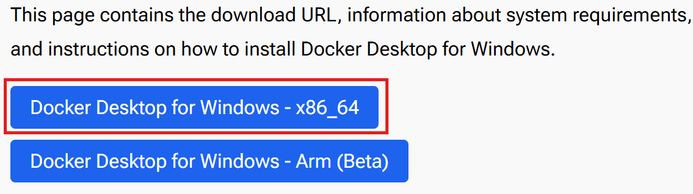  

  - 다운로드한 파일을 실행하여 설치: 기본 옵션 그대로 설치   

- 테스트 하기
  - Mac사용자는 터미널을 열고 Windows사용자는 MobaXTerm에서 Local터미널을 엽니다.   
  - Docker version 확인    
    ```
    docker version 
    ```    

| [Top](#목차) |

---

## Microsoft Visual Studio Code 설치 
Microsoft Visual Studio Code(vscode라고 많이 부름)는 주로 Javascript, Python과 같은   
Interpreter 언어를 개발할 때 사용하는 IDE(Integrated Development Environment)입니다.  
> **Interpreter 언어**: 통역가라는 직역처럼 별도의 실행파일을 만들지 않고 소스를 바로 실행하는 언어   


다운로드 페이지에 접속하여 설치파일을 다운로드하여 설치: [vscode설치](https://code.visualstudio.com/download) 

| [Top](#목차) |

---

## Git Client 설치
Git은 Git 서버 저장소와 Git Local 저장소 사이에서 소스를 올리고 내리는 등의   
작업을 하는 데 사용하는 CLI툴입니다.  

Windows 사용자는 [Git Client 설치하기](https://git-scm.com/downloads)에 접속하여 설치파일을 다운로드 받아 설치합니다.   
Mac사용자는 아래 명령으로 설치할 수 있습니다.  
```
brew install git
```

| [Top](#목차) |

---

## Node.js 설치
Node.js는 서버 프로그램을 만들수 있는 Javascript 기반 언어입니다.  
Node.js Runtime엔진을 설치합니다.   

- Node.js 설치  
  [Node.js 설치하기](https://nodejs.org/en/)페이지로 접속하여  
  설치파일을 다운로드 받아 설치합니다.   
  설치 시 아래 옵션 반드시 체크하여 부가적인 프로그램 설치해야 합니다.     
  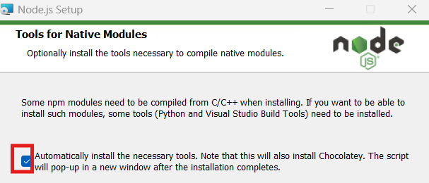  

  나머지는 기본 옵션 그대로 설치하면 됩니다.    

- (Windows Only) Windows 사용자는 반드시 아래 설정 해야 합니다.  
  DOS창에서 아래 명령을 입력하십시오.   
  이걸 해야 하는 이유는 전역모듈 설치의 기본 경로가 '{사용자 홈}\AppData\Roaming\npm'으로 되어 있어   
  파일 권한 때문에 에러가 날 수도 있기 때문입니다.   
  ```
  mkdir ~/mypackages 
  npm config set prefix "c:\home\mypackages"
  npm config set cache "c:\home\mypackages\npm-cache"  
  ```
  그리고 PATH에 c:\home\mypackages 를 추가합니다.   
  PATH 추가하는 방법은 JDK경로 설정할 때 했던 것을 참고하세요.  

- 테스트 
  Local Ubuntu 에서 테스트 합니다.  
  - 작업디렉토리로 이동     
  ```
  cd ~/workspace 
  ```
  > **작업디렉토리를 안 만들었으면 생성**   
  > '~'는 사용자 홈디렉토리를 의미   
  > -p 옵션은 이미 디렉토리가 있으면 에러 내지말고 종료하라는 의미   
  ```
  mkdir -p ~/workspace 
  cd ~/workspace  
  ```
  
  아래 명령 입력 시 에러 안나면 잘 설치 된겁니다.  
  ```
  npm -v
  ```

| [Top](#목차) |

---

## DBeaver 설치 
DBeaver는 SQL Client 프로그램의 하나입니다.   
Database를 관리하고 SQL로 테이블과 데이터를 처리할 수 있습니다.    

- 설치하기 
  - 설치파일 다운로드: [설치파일 다운로드](https://dbeaver.io/download/) 링크를 열어 OS에 맞는 파일을 다운로드    
  - 파일을 실행하여 설치합니다. 기본 옵션 그대로 설치합니다.   
- 테스트   
  - DBeaver를 실행합니다.   
      
    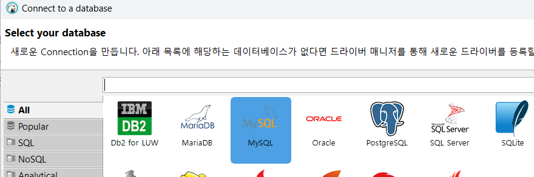  
    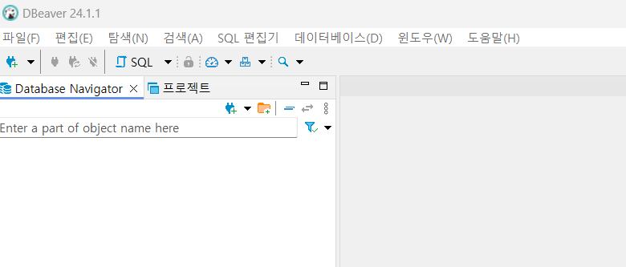           

  - 테스트로 MySQL Database를 컨테이너로 실행합니다.  
    Windows 사용자는 MobaXTerm, Mac사용자는 터미널에서 실행     
    ```
    docker run -d --name mysql -p 3306:3306 -e MYSQL_ROOT_PASSWORD=P@ssw0rd$ mysql
    ```     

  - 아래와 같이 DB를 연결 합니다.: Root암호는 P@ssw0rd$임(MySQL 컨테이너 실행 시 옵션으로 지정)  
    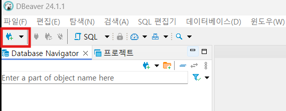  
    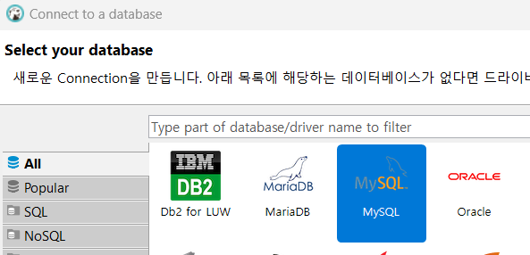  
        
  
  - Driver파일을 다운로드 한 후 아래와 같이 경고가 나오면  아래를 수행합니다.  
      
    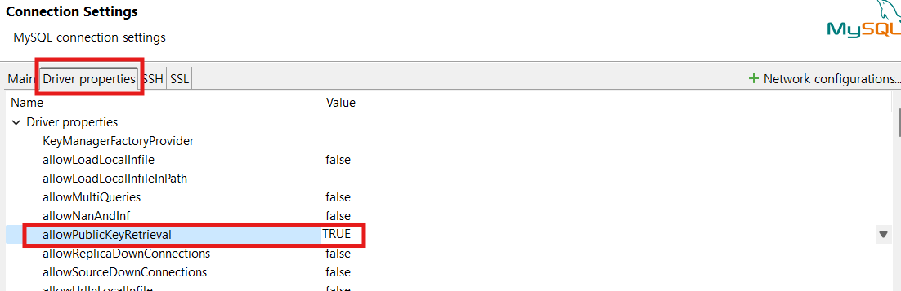  

  - 아래와 같이 DB가 연결되면 성공!   
    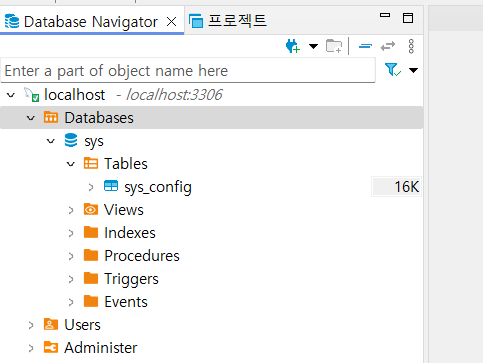  
   
  - SQL편집기를 테스트 해 봅니다.   
      
    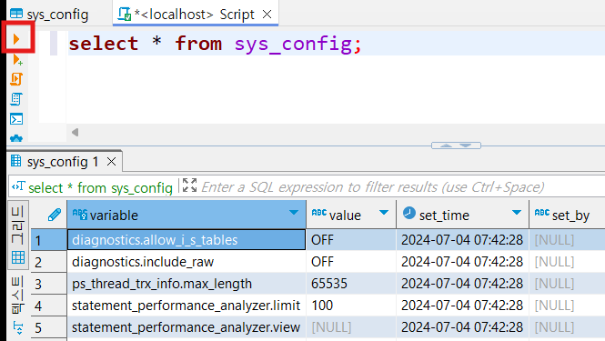    

| [Top](#목차) |

---

## GitHub 회원가입 및 토큰 생성  
https://github.com을 여시고 회원 가입을 하십시오.   
Git Repository에 소스를 업로드할 때 사용할 토큰을 생성 하십시오. 
토큰은 잊어 버리지 않게 잘 보관해 놓으십시오.   
[토큰 생성](https://github.com/cna-bootcamp/cna-handson/blob/main/backend/tip.md#github-%EC%9D%B8%EC%A6%9D-%ED%86%A0%ED%81%B0-%EC%83%9D%EC%84%B1) 페이지를 참고하여 만드세요.   

| [Top](#목차) |

---

## Docker HUB 회원가입   
Docker Hub는 컨테이너 이미지를 내려받고 저장할 공개된 이미지 저장소입니다.   
https://hub.docker.com 으로 접근하여 회원가입을 하십시오.   

| [Top](#목차) |

---
