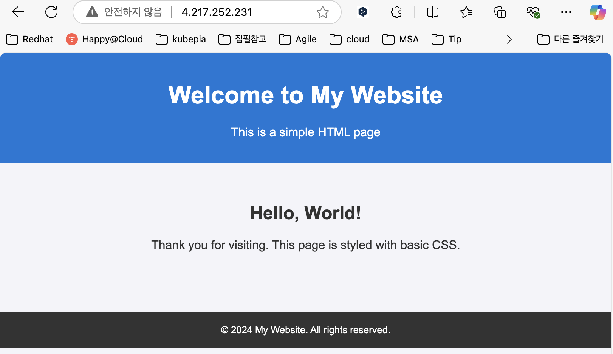

# 서버 작업 환경 설정

## 목차
- [서버 작업 환경 설정](#서버-작업-환경-설정)
  - [목차](#목차)
  - [Azure 구독(무료 평가판)](#azure-구독무료-평가판)
  - [Azure 구독(유료 서비스)](#azure-구독유료-서비스)
  - [리소스 프로바이더 등록](#리소스-프로바이더-등록)
  - [리소스 그룹 생성](#리소스-그룹-생성)
  - [Azure CLI 설치 및 로그인(Windows Only)](#azure-cli-설치-및-로그인windows-only)
  - [Azure CLI 설치 및 로그인(Mac Only)](#azure-cli-설치-및-로그인mac-only)
  - [기본 configuration 셋팅](#기본-configuration-셋팅)
  - [AKS/ACR 생성, 삭제](#aksacr-생성-삭제)
  - [VNET,NSG,SNET 생성](#vnetnsgsnet-생성)
  - [VNET Peering](#vnet-peering)
  - [Azure 서비스에 VNET/Subnet 연결](#azure-서비스에-vnetsubnet-연결)
  - [Bastion VM 생성](#bastion-vm-생성)
  - [MobaXTerm 세션 작성](#mobaxterm-세션-작성)
  - [필요 툴 설치](#필요-툴-설치)
  - [nginx 서버 설치](#nginx-서버-설치)
  - [SSL 설정](#ssl-설정)
  - [AKS Node pool 추가](#aks-node-pool-추가)

> 실습환경에서는 Azure 구독, 리소스 프로바이더 등록, 리소스 그룹 생성은 이미 되어 있으므로 할 필요 없습니다.   
> 리소스 그룹명은 Azure포탈(https://portal.azure.com)에서 확인합니다.    
> 
---

## Azure 구독(무료 평가판)
회원가입 후 Azure portal(https://portal.azure.com)에 로그인 합니다.

- 첫 페이지에서 [시작]버튼 클릭

  
- [Try Azure for free] 클릭 
무료 평가판은 일부 서비스에 한 해 200$까지 사용할 수 있는 Credit을 제공합니다. 
만약, 이미 사용했거나 바로 유료 구독을 하려면 [Pay as you go]를 클릭합니다.  


- ‘Agreement’의 체크 박스를 모두 체크하고 [Next]클릭

- Identity verification by phone
전화번호 입력(예: 821040954035)후 [Text Me]클릭. 
핸드폰으로 온 인증코드 6자리를 입력하여 본인확인

- Identity verification by Card
본인 카드 정보와 주소를 입력

| [Top](#목차) |

---

## Azure 구독(유료 서비스)
AKS를 사용하기 위해서는 유료서비스까지 구독해야 합니다. 
첫페이지에서 [시작]을 누른 후 다음 페이지에서 [Pay as you go]를 클릭합니다. 

Agreement, Card 정보 제공 후, ‘Add technical support’에서 마지막 옵션을 선택합니다.
만약 유료 기술 지원 서비스를 받으려면 다른 옵션을 선택합니다.  


| [Top](#목차) |

---

## 리소스 프로바이더 등록
VM, CPU, 메모리와 같은 리소스를 사용하기 위해 리소스 프로파이더를 등록해야 합니다. 
 
‘구독’서비스를 찾아 클릭합니다. 


구독 이름을 클릭합니다.


리소스 프로바이더를 등록합니다.
‘compute’로 필터링한 후 ‘Microsoft.Compute’를 선택하고 상단의 [등록]버튼을 클릭


‘Microsoft.Compute’의 상태가 ‘Registered’가 될때까지 기다립니다. 약 3~4분 걸립니다. 

완료 후 ‘사용량 및 할당량’ 메뉴를 클릭하면 리소스 사용 현황과 할당량이 나타납니다. 


'Microsoft.ContainerService'를 등록합니다.  
  

'Microsoft.Storage'룰 등록합니다.  

| [Top](#목차) |

---

## 리소스 그룹 생성 
1. 리소스 그룹 생성  
리소스 그룹을 생성합니다. 
  
  

| [Top](#목차) |

---

## Azure CLI 설치 및 로그인(Windows Only)
Window사용자는 MobaXTerm을 사용하여 로컬 Ubuntu에서 작업 합니다.   

- 로컬 Ubuntu 로그인(Windows Only)   
  MobaXTerm을 실행하고 작성한 WSL세션을 클릭하여 로그인합니다.  
  **이후 작업은 모두 로컬 ubuntu에서 수행**합니다.  

- azure CLI 설치
  ```
  # 1. Microsoft 서명 키 추가
  curl -sL https://packages.microsoft.com/keys/microsoft.asc | gpg --dearmor | sudo tee /etc/apt/trusted.gpg.d/microsoft.gpg > /dev/null

  # 2. Azure CLI 저장소 추가
  AZ_REPO=$(lsb_release -cs)
  echo "deb [arch=amd64] https://packages.microsoft.com/repos/azure-cli/ $AZ_REPO main" | sudo tee /etc/apt/sources.list.d/azure-cli.list

  # 3. 패키지 리스트 업데이트 및 설치
  sudo apt-get update
  sudo apt-get install azure-cli
  ```

- azure Login:   
  명령 수행 후 나오는 url을 브라우저에서 열고 제시된 코드를 넣어 로그인.  
  ```
  ubuntu@DESKTOP-PJ5MG3E:~$ az login --use-device-code
  To sign in, use a web browser to open the page https://microsoft.com/devicelogin and enter the code NVEJDG9JD to authenticate.
  ```


| [Top](#목차) |

---

## Azure CLI 설치 및 로그인(Mac Only)
로컬 터미널을 열어 작업합니다.  

Azure CLI 설치
```
https://learn.microsoft.com/ko-kr/cli/azure/install-azure-cli
```

Azure CLI 로그인
```
az login
```

※ Troubleshooting
아래 예와 같은 에러 메시지가 나오면 tenant id를 이용하여 로그인 합니다. 
복수ID를 사용하는 경우는 각 ID별 tenant가 달라 생기는 오류입니다. 
```
Retrieving tenants and subscriptions for the selection...
Authentication failed against tenant 278d6598-3ab5-43c9-87d7-523f6eda4704 'Default Directory': AADSTS50076: Due to a configuration change made by your administrator, or because you moved to a new location, you must use multi-factor authentication to access '797f4846-ba00-4fd7-ba43-dac1f8f63013'. Trace ID: 919a4b59-da35-4227-aae5-d14b761d6600 Correlation ID: d471e8f4-1edc-4942-a044-b627e8c7aa60 Timestamp: 2025-01-30 07:39:05Z
If you need to access subscriptions in the following tenants, please use `az login --tenant TENANT_ID`.
278d6598-3ab5-43c9-87d7-523f6eda4704 'Default Directory'
No subscriptions found for unicorn.agile.ai@gmail.com.
```

‘관리 그룹’서비스를 찾아 Tenant ID를 확인합니다. 


아래와 같이 tenant옵션을 이용하여 로그인 합니다. 
다음 로그인 시 동일 tenant 라면 ‘tenant’옵션 없이 로그인할 수 있습니다. 
```
az login --tenant {tenant id}
```

| [Top](#목차) |

---

## 기본 configuration 셋팅
명령어에서 반복적으로 사용할 Resource Group과 Location값을 기본 설정에 셋팅합니다.   
```
az configure -d group={리소스그룹} location={Location}
```
예시)
```
az configure -d group=tiu-dgga-rg location=koreacentral
```

설정된 값을 확인합니다.
```
az configure -l -o table
```

| [Top](#목차) |

---

## AKS/ACR 생성, 삭제
AKS/ACR의 Naming rule은 아래와 같습니다.  
- userid: dg{차수 2자리}{일련번호 2자리}. 예) dg0101    
- 개인별 학습 시: {userid}-aks, {userid}cr. 예) dg0101-aks, dg0101cr  
- 팀별 MVP개발 시: {teamid}-aks, {teamid}cr. 예) lego-aks, legocr   

> 본 가이드는 dg0100을 userid로 사용하여 설명합니다.  
  
1. AKS
- AKS 클러스터 생성
  ```
  az aks create [-g {리소스그룹} -l {location}] \
  -n {AKS명} \
  -c {노드수} \
  --min-count {노드 최소수} \
  --max-count {노드 최대수} \
  -s {VM Size type} \
  --node-osdisk-type {Managed or Ephemeral} \
  --node-osdisk-size {각 노드 내부 Disk size} \
  --enable-cluster-autoscaler \
  --generate-ssh-keys
  ```
  
  > Tip: **VM Size type 보기**  
  > [도움말](https://learn.microsoft.com/ko-kr/azure/virtual-machines/sizes/overview?tabs=breakdownseries%2Cgeneralsizelist%2Ccomputesizelist%2Cmemorysizelist%2Cstoragesizelist%2Cgpusizelist%2Cfpgasizelist%2Chpcsizelist)   
  > ```
  > https://portal.azure.com/#view/Microsoft_Azure_Compute/SpecPickerV2Blade/subscriptionId/22e2a034-41ca-431a-b73d-6d2be7dde51f/regionId/koreacentral/hideCost~/false/specFiltering~/%7B%22disabledSpecs%22%3A%5B%5D%2C%22platform%22%3A%22Linux%22%2C%22hideDiskTypeFilter%22%3Afalse%2C%22zone%22%3A%5B%5D%2C%22minMemoryGB%22%3A4%2C%22minvCPUs%22%3A2%2C%22securityType%22%3A%22AllowAll%22%7D
  > ```
  > 
  > 제일 많이 사용하는 VM Size type(마지막 컬럼의 비용은 월 사용비용임)  
  > **교육시에는 'Standard_B2s'를 사용하고 MVP개발시에는 'Standard_DS3_V2' 사용**   
  >   

  > Tip: **node-osdisk-type**  
  > Managed: 영구 Disk에 저장, Ephemeral: 임시 OS Disk에 저장  
  > Ephemeral 타입으로 지정하면 속도는 빨라지나 영구 Disk에 저장하지 않은 데이터(예: 로그, 컨테이너 이미지)는 재시작 시 삭제됨  
  > Ephemeral 타입으로 지정하려면 node의 최대 캐시 사이즈가 OS Disk크기보다 더 커야함.  
  > node의 최대 캐시 사이즈는 VM Size type에 따라 지정되므로, 더 고비용의 VM size type을 사용해야 할 수도 있음.   
  
  예시)  
  ```
  az aks create \
  -n dg0100-aks \
  -c 2 \
  --min-count 2 \
  --max-count 10 \
  -s Standard_B2s \
  --node-osdisk-type Managed \
  --node-osdisk-size 200 \
  --enable-cluster-autoscaler \
  --generate-ssh-keys
  ```

- AKS Credention 구하기  
  ```
  az aks get-credentials [-g {리소스그룹}] -n {AKS명} -f ~/.kube/config
  ```
  예시)
  ```
  az aks get-credentials -n dg0100-aks -f ~/.kube/config
  ```

- AKS 클러스터 삭제  
  ```
  az aks delete [-g {리소스그룹}] -n {AKS명} --yes
  ```
  예시)
  ```
  az aks delete -n dg0100-aks --yes
  ```

- ACR 생성
  이미 존재하는 ACR인지 체크  
  ```
  az acr check-name -n [-g {리소스그룹}] -n {ACR명}
  ```
  예시)
  ```
  az acr check-name -n dg0100cr
  ```

  ```
  az acr create [-g {리소스그룹}] -n {ACR명} --sku Basic --admin-enabled true
  ```
  > 주의: ACR명에는 대시나 언더바와 같은 특수기호를 사용할 수 없고 영문소문자와 숫자만 가능합니다.   

  예시)
  ```
  az acr create -n dg0100cr --sku Basic --admin-enabled true
  ```

- ACR 삭제
  ```
  az acr delete [-g {리소스그룹}] -n {ACR명}
  ```
  예시)
  ```
  az acr delete -n dg0100cr --yes
  ```

- AKS에 ACR의 image pulling 권한 등록
  AKS에서 ACR에 접근하여 컨테이너 이미지를 pulling할 수 있도록 AKS의 managed identity에 ACR에 대한 AcrPull 역할을 할당
  ```
  ACR_ID=$(az acr show -g {리소스그룹} -n {ACR명} --query "id" -o tsv)
  echo $ACR_ID
  az aks update [-g {리소스그룹}] -n {AKS명} --attach-acr $ACR_ID
  ```

  예시)
  ```
  ACR_ID=$(az acr show -n dg0100cr --query "id" -o tsv)
  echo $ACR_ID
  az aks update -n dg0100-aks --attach-acr $ACR_ID
  ```

  결과는 Azure Portal의 ACR 페이지에서 확인할 수 있습니다.    
    

- 참고
  - [AKS/ACR 생성 shell](https://drive.google.com/file/d/1Ho48T-R-t9lcZ3mfPgARwYQqOTViM-TI/view?usp=drive_link)  
  - [AKS/ACR 삭제 shell](https://drive.google.com/file/d/1TibLKAnBE8CedyyUrvW0I1IXGUWTHqZf/view?usp=drive_link)  
   

| [Top](#목차) |

---

## VNET,NSG,SNET 생성  
- 목적: 통신이 필요한 Azure서비스(예: VM, Azure 관리용 DB, Azure WebApp)를 만들기 위함    
  - VNET(Virtual Network: 가상 네트워크)   
    - 외부와 통신하기 위한 기본 네트워크 환경 제공
    - 비유) 아파트 단지와 같이 다른 건물들(Azure서비스)이 들어설 수 있는 가상 공간 제공      
  - SNET(Subnet)
    - VNet을 각 Azure서비스의 목적별로 더 작게 분할한 네트워크 환경 제공  
    - 비유) 아파트 단지의 각 구역(상가지역, 커뮤니티 공간, 거주지역)별로 나누는 것과 유사  
  - NSG(Network Security Group)
    - 각 Subnet에 적용하는 Inboud/Outbound 정책을 설정하는 리소스  

- HOW  
  아래 예와 같이 Resource Group > VNET > Subnet > NIC의 계층적 구조로 만들어집니다.  
  NIC는 Subnet에서 하나의 IP를 부여 받아 VM에 할당하게 됩니다.  
  NSG는 Subnet에 적용되어 inbound/outbound 통신을 제어합니다.   
  

- 기본 파라미터와 변수 설정  
  'ID'값은 본인ID로 변경해야 함  
  ```
  az configure -l -o table

  export ID=dg0100
  az configure --defaults group=${ID}-rg location=koreacentral

  export ADDR_PREFIX=10.17.0
  export VNET=${ID}-vnet  
  export NSG=${ID}-nsg
  export PUB_SNET=${VNET}-pub-snet
  export PRI_SNET=${VNET}-pri-snet
  export PE_SNET=${VNET}-pe-snet
  export PSQL_SNET=${VNET}-psql-snet
  ```

- 기존 생성 객체 확인  
  실습 환경에서는 이미 모두 생성이 되어 있으므로 확인만 합니다.  
  단, VNET과 NSG변수값은 바꾸십시오.  
  ```
  az network vnet list -o table
  ```
  위 결과를 보고 VNET 변수 값을 변경 합니다.   

  ```
  az network nsg list -o table
  ```
  위 결과를 보고 NSG 변수 값을 변경 합니다.  

  ```
  az network vnet subnet list --vnet-name ${VNET} -o table
  ```

- VNET 생성  
  실습 환경에서는 이미 모두 생성이 되어 있으므로 확인만 합니다.   
  주소 공간은 모든 서브넷을 포함할 수 있도록 지정해야 합니다.  
  주소 공간은 private ip 대역대인 10, 172, 192로 시작해야 합니다.  
  슬래쉬 뒤의 값은 IP의 갯수를 의미합니다. 갯수를 계산하는 공식은 2^(32-{지정값})입니다.  
  '24'로 지정하면 2^8승이므로 256개의 IP를 지정할 수 있다는 의미입니다.  
  ```
  # VNet 생성
  az network vnet create -n ${VNET} --address-prefix ${ADDR_PREFIX}.0/24

  # VNet 확인 
  az network vnet list -o table 
  ```

- NSG 생성
  실습 환경에서는 이미 모두 생성이 되어 있으므로 확인만 합니다.  
  ```
  # NSG(Network Security Group) 생성  
  az network nsg create -n ${NSG}

  # NSG 확인
  az network nsg list -o table
  ```

- SNET 생성  
  실습 환경에서는 이미 모두 생성이 되어 있으므로 확인만 합니다.  
  각 목적별로 Subnet 객체를 생성합니다.  
  - 퍼블릭 서브넷(pub-snet)
    - 외부와 직접 통신이 필요한 서비스 배치
    - 예: 웹 서버, 로드 밸런서
  - 프라이빗 서브넷(pri-snet)
    - 외부와 직접 통신이 필요 없는 서비스 배치
    - 예: 내부 애플리케이션 서버
  - Private Endpoint 서브넷(pe-snet)
    - Azure 서비스와의 프라이빗 연결을 위한 공간
    - 예: Storage Account, Key Vault와의 보안 연결
  - 데이터베이스 서브넷(psql-snet)
    - 데이터베이스 전용 공간
    - 더 엄격한 보안 규칙 적용 가능

  각 Subnet당 32개의 IP를 사용하도록 만듭니다.  
  앞 5개의 IP는 Azure시스템에서 사용하므로 실제로는 27개의 IP를 사용할 수 있습니다.  
  Private Endpoint 서브넷은 Azure PaaS 서비스(Storage, SQL, KeyVault 등)에 대한 프라이빗 연결을 제공하므로,  
  'private-endpoint-network-policies'옵션을 Disable하여 NSG에 설정된 정책이 Subnet에 적용되지 않게 해야 합니다.    
  
  아래 예에서는 모든 Subnet이 동일한 NSG를 공유하나 실제로는 각 Subnet별로 별도의 NSG를 갖는것이 더 일반적입니다.  
  ```
  # 각 서브넷 생성
  az network vnet subnet create -n ${PUB_SNET} \
    --vnet-name ${VNET} \
    --address-prefix ${ADDR_PREFIX}.0/27 \
    --network-security-group ${NSG}

  az network vnet subnet create -n ${PRI_SNET} \
    --vnet-name ${VNET} \
    --address-prefix ${ADDR_PREFIX}.32/27 \
    --network-security-group ${NSG}

  az network vnet subnet create -n ${PE_SNET} \
    --vnet-name ${VNET} \
    --address-prefix ${ADDR_PREFIX}.64/27 \
    --private-endpoint-network-policies Disabled \
    --network-security-group ${NSG}

  az network vnet subnet create -n ${PSQL_SNET} \
    --vnet-name ${VNET} \
    --address-prefix ${ADDR_PREFIX}.96/27 \
    --network-security-group ${NSG}

  # 서브넷 생성 확인
  az network vnet subnet list --vnet-name ${VNET} -o table 
  ```

  > 참고 : Subnet에 연결된 NSG 변경  
  > ```
  > az network vnet subnet update \
  > -n ${PUB_SNET} \
  > --vnet-name ${VNET} \
  > --network-security-group ${ID}-bastionNSG
  > ```

- 기존 서브넷의 주소 공간과 사용량 확인
  ```
  # 서브넷 상세 정보 확인
  az network vnet subnet show -n {subnet} --vnet-name $VNET

  # 서브넷의 IP 사용현황 확인
  az network vnet subnet list-available-ips -n {subnet} --vnet-name $VNET
  ```

| [Top](#목차) |

---

## VNET Peering  
VNET간에 Peering을 통해 통신할 수 있습니다.  
실습할 필요는 없고 이론적으로 이해만 하시면 됩니다.  

```
# 기존 VNET 피어링 확인
az network vnet peering list --vnet-name $VNET
```

아래는 VNET Peering 예제 입니다.  
```
# VNET Peering 
az network vnet peering create \
--name {peering name} \
--vnet-name $VNET \
--remote-vnet {대상 VNET명} \
--allow-vnet-access
```

| [Top](#목차) |

---

## Azure 서비스에 VNET/Subnet 연결  

실습할 필요는 없고 이해만 하시면 됩니다.  
```
# Azure WebApp Service 예시: Private endpoint subnet을 연결  
az webapp vnet-integration add \
  --name {app-name} \
  --vnet $VNET \
  --subnet ${PE_SNET}
```

2. Application Gateway 설정

```
# Application Gateway VNET/Subnet 연결 
az network application-gateway create \
  --name {gateway-name} \
  --vnet-name $VNET \
  --subnet {subnet-name} \
  --public-ip-address {public-ip-name} \
  --sku Standard_v2
```

| [Top](#목차) |

---

## Bastion VM 생성  
AKS 접근을 위한 bastion서버와 nginx 서버 설치를 위해 VM을 생성합니다.  
bastion(베스티언)서버는 AKS를 kubectl이나 nginx와 같은 WAS를 통해 접근하기 위한 Gateway역할 서버입니다.  

- VNET과 Public Subnet을 확인  
  아래 명령으로 VNET값을 확인하고 VNET과 Public Subnet변수에 지정    
  ```
  az network vnet list -o table
  export VNET={VNET}
  ```   

- Public subnet 생성  
  ```
  ID={본인ID}
  ID_NUM=${ID: -2}
  export MY_PUB_SNET=${ID}-pub-snet
  
  az network vnet subnet create \
  --name ${MY_PUB_SNET} \
  --vnet-name ${VNET} \
  --address-prefixes 10.0.2${ID_NUM}.0/28  
  ```

- VM 생성
  Public Subnet에 연결합니다.  
  Size는 2Core/4GB의 사양인 'Standard_B2s'로 지정합니다.  
  ```
  az vm create \
    -n ${ID}-bastion \
    --image Ubuntu2204 \
    --admin-username azureuser \
    --generate-ssh-keys \
    --vnet-name ${VNET} \
    --subnet ${MY_PUB_SNET} \
    --size Standard_DS2_v3
  ```
  
  만약, 안돼면 아래와 같이 size를 다른 걸로 변경해 보세요.   
  ```
  az vm create \
    -n ${ID}-bastion \
    --image Ubuntu2204 \
    --admin-username azureuser \
    --generate-ssh-keys \
    --vnet-name ${VNET} \
    --subnet ${MY_PUB_SNET} \
    --size Standard_B2s
  ```

  아래 예와 같이 VM과 Disk, NSG, Public IP, NIC 객체가 생성됩니다.   
    

- PORT 오픈   
  생성된 NSG의 포트를 오픈 합니다.  
  NSG의 이름은 VM이름 뒤에 NSG가 붙어서 생성됩니다.  
  'priority'는 100~4096사이의 값으로 중복되지 않게 지정합니다.  
  
  ```
  # 80 포트 오픈
  export PORT=80  
  az network nsg rule create \
  --nsg-name ${ID}-bastionNSG \
  --name Allow-HTTP-$PORT \
  --priority 100 \
  --access Allow \
  --direction Inbound \
  --protocol Tcp \
  --source-port-ranges '*' \
  --destination-port-ranges $PORT
  ```

  ```
  # 443 포트 오픈
  export PORT=443  
  az network nsg rule create \
  --nsg-name ${ID}-bastionNSG \
  --name Allow-HTTPS-$PORT \
  --priority 200 \
  --access Allow \
  --direction Inbound \
  --protocol Tcp \
  --source-port-ranges '*' \
  --destination-port-ranges $PORT
  ```
  
  rule 확인  
  ```
  az network nsg rule list --nsg-name ${ID}-bastionNSG -o table
  ```

| [Top](#목차) |

---

## MobaXTerm 세션 작성  

VM의 IP를 구합니다.  
```
az vm show -d -n ${ID}-bastion --query publicIps -o tsv
```

VM 생성 시 자동으로 ~/.ssh 디렉토리에 ssh key가 생성됩니다.  
그 파일을 c:\home 디렉토리에 다운로드 합니다.    
  
  

SSH 세션을 작성합니다.  
  
  
위에서 다운로드한 id_rsa파일을 지정합니다.  
  

VM 접속이 되는지 테스트 합니다.  

## 필요 툴 설치  

아래 링크를 참조하여 필요한 툴을 설치하세요.  
https://github.com/cna-bootcamp/handson-azure/blob/main/prepare/setup-local.md#%EB%A1%9C%EC%BB%AC-ubuntu-%EB%98%90%EB%8A%94-remote-vm%EC%97%90-%ED%88%B4-%EC%84%A4%EC%B9%98


| [Top](#목차) |

---

## nginx 서버 설치  
Bastion VM에서 수행합니다.  
- Nginx 설치

  ```
  sudo apt update
  sudo apt install nginx -y
  ```

  ```
  sudo systemctl start nginx
  sudo systemctl enable nginx
  ```

  ```
  sudo systemctl status nginx
  ```

- Nginx 환경설정
  ```
  sudo vi /etc/nginx/nginx.conf
  ```
  
  아래 내용으로 변경합니다.  
  Windows 사용자는 MobaXTerm에서 기본 에디터를 사용하여 변경해도 됩니다.   
  vi를 이용하려면 아래 순서로 작업합니다.  
  - 맨 위로 커서를 옮기기
  - '1000dd'를 입력하여 기존 내용 모두 삭제  
  - 'i'를 눌러 편집 모드로 변경   
  - 아래 내용을 클립보드에 복사한 후 CTRL-V(맥은 Command-V)키로 붙여넣기 함  
  - ESC누른 후 ':'을 입력하여 명령모드로 전환  
  - 맨 아래 콜론 뒤에 'wq'를 입력하고 Enter키를 누름  
  
  ```
  user www-data;
  worker_processes auto;
  pid /run/nginx.pid;
  events {
      worker_connections 768;
  }
  http {
      sendfile on;
      tcp_nopush on;
      tcp_nodelay on;
      keepalive_timeout 65;
      types_hash_max_size 2048;
      include /etc/nginx/mime.types;
      default_type application/octet-stream;
      access_log /var/log/nginx/access.log;
      error_log /var/log/nginx/error.log;
      gzip on;
      include /etc/nginx/conf.d/*.conf;
      include /etc/nginx/sites-enabled/*;
  }
  ```
  
  80포트에 대한 설정을 합니다.  
  ```
  sudo vi /etc/nginx/sites-available/default
  ```

  ```
  server {
      listen 80;
      server_name _;
      root /var/www/html;
      index index.html;
      location / {
          try_files $uri $uri/ =404;
      }
  }
  ```

  설정이 적용 되려면 '/etc/nginx/sites-enabled'에 링크를 만들어야 합니다.  
  ```
  sudo rm -f /etc/nginx/sites-enabled/default
  sudo ln -s /etc/nginx/sites-available/default /etc/nginx/sites-enabled/
  ```

  설정에 문제가 없는지 테스트 하고 nginx서버를 재시작 합니다.  
  ```
  sudo nginx -t
  sudo systemctl reload nginx
  ```

- 테스트
  ```
  sudo vi /var/www/html/index.html
  ``` 

  ```  
  <!DOCTYPE html>
  <html lang="en">
  <head>
      <meta charset="UTF-8">
      <meta name="viewport" content="width=device-width, initial-scale=1.0">
      <title>Welcome to My Website</title>
      <style>
          body {
              font-family: Arial, sans-serif;
              margin: 0;
              padding: 0;
              background-color: #f4f4f9;
              color: #333;
              text-align: center;
          }
          header {
              background-color: #0078d7;
              color: white;
              padding: 1rem 0;
          }
          main {
              padding: 2rem;
          }
          footer {
              margin-top: 2rem;
              background-color: #333;
              color: white;
              padding: 1rem 0;
              font-size: 0.8rem;
          }
      </style>
  </head>
  <body>
      <header>
          <h1>Welcome to My Website</h1>
          <p>This is a simple HTML page</p>
      </header>
      <main>
          <h2>Hello, World!</h2>
          <p>Thank you for visiting. This page is styled with basic CSS.</p>
      </main>
      <footer>
          &copy; 2024 My Website. All rights reserved.
      </footer>
  </body>
  </html>
  ```

  웹브라우저에서 'http://{VM Public IP}'로 접근하여 정상적으로 표시되는지 확인합니다.  
  


| [Top](#목차) |

---
Bastion VM에서 수행합니다.  
## SSL 설정  

- 정식 SSL 인증서 받기  
  인증서 생성 프로그램 설치  
  ```
  sudo apt update
  sudo apt install snapd
  sudo snap install --classic certbot
  sudo ln -s /snap/bin/certbot /usr/bin/certbot
  ```
 
- SSL 인증서 만들기  
  '{domain}'은 위 SSL설정의 'server_name'에 지정한 {본인ID}.{VM Public IP}.nip.io을 사용합니다.  
  ```
  sudo certbot --nginx -d {domain}
  ```
  결과 예시)
  ```
  azureuser@dg0100-bastion:/etc/nginx/sites-available$ sudo certbot --nginx -d dg0100.4.217.252.231.nip.io
  Saving debug log to /var/log/letsencrypt/letsencrypt.log
  Enter email address (used for urgent renewal and security notices)
  (Enter 'c' to cancel): hiondal@gmail.com

  - - - - - - - - - - - - - - - - - - - - - - - - - - - - - - - - - - - - - - - -
  Please read the Terms of Service at
  https://letsencrypt.org/documents/LE-SA-v1.4-April-3-2024.pdf. You must agree in
  order to register with the ACME server. Do you agree?
  - - - - - - - - - - - - - - - - - - - - - - - - - - - - - - - - - - - - - - - -
  (Y)es/(N)o: Y

  - - - - - - - - - - - - - - - - - - - - - - - - - - - - - - - - - - - - - - - -
  Would you be willing, once your first certificate is successfully issued, to
  share your email address with the Electronic Frontier Foundation, a founding
  partner of the Let's Encrypt project and the non-profit organization that
  develops Certbot? We'd like to send you email about our work encrypting the web,
  EFF news, campaigns, and ways to support digital freedom.
  - - - - - - - - - - - - - - - - - - - - - - - - - - - - - - - - - - - - - - - -
  (Y)es/(N)o: Y  
  Account registered.
  Requesting a certificate for dg0100.4.217.252.231.nip.io

  Successfully received certificate.
  Certificate is saved at: /etc/letsencrypt/live/dg0100.4.217.252.231.nip.io/fullchain.pem
  Key is saved at:         /etc/letsencrypt/live/dg0100.4.217.252.231.nip.io/privkey.pem
  This certificate expires on 2025-05-01.
  These files will be updated when the certificate renews.
  Certbot has set up a scheduled task to automatically renew this certificate in the background.

  Deploying certificate
  Could not install certificate

  NEXT STEPS:
  - The certificate was saved, but could not be installed (installer: nginx). After fixing the error shown below, try installing it again by running:
    certbot install --cert-name dg0100.4.217.252.231.nip.io

  Could not automatically find a matching server block for dg0100.4.217.252.231.nip.io. Set the `server_name` directive to use the Nginx installer.
  Ask for help or search for solutions at https://community.letsencrypt.org. See the logfile /var/log/letsencrypt/letsencrypt.log or re-run Certbot with -v for more details.
  ```

- nginx 설정 수정  

  ```
  sudo vi /etc/nginx/sites-available/default 
  ```

  기존 설정에 SSL 설정을 추가합니다.  
  'server_name'은 {본인ID}.{VM Public IP}.nip.io로 지정합니다.  
  ssl key 파일의 경로는 위 SSL 인증서 생성 결과 마지막 쯤에 있는 값과 동일하게 설정합니다.  
  'location' 섹션은 proxying을 위한 설정입니다. 이는 나중에 사용하니 아래 내용을 그대로 사용합니다.  
  ```
  server {
      listen 80;
      server_name _;
      root /var/www/html;
      index index.html;
      location / {
          try_files $uri $uri/ =404;
      }
  }

  server {
      listen 443 ssl;
      server_name dg0100.4.217.252.231.nip.io;
      ssl_certificate /etc/letsencrypt/live/dg0100.4.217.252.231.nip.io/fullchain.pem;
      ssl_certificate_key /etc/letsencrypt/live/dg0100.4.217.252.231.nip.io/privkey.pem;
      root /var/www/html;
      index index.html;

      # Proxying
      ssl_protocols TLSv1.2 TLSv1.3;
      ssl_ciphers HIGH:!aNULL:!MD5;
      location / {
          #proxy_pass http://20.214.113.85:80;
          proxy_ssl_verify off;
          proxy_buffer_size 64k;
          proxy_buffers 4 64k;
          proxy_busy_buffers_size 64k;
          proxy_set_header Host $host;
          proxy_set_header X-Real-IP $remote_addr;
          proxy_set_header X-Forwarded-For $proxy_add_x_forwarded_for;
          proxy_set_header X-Forwarded-Proto $scheme;
          proxy_read_timeout 60s;
          proxy_connect_timeout 60s;
          proxy_send_timeout 60s;
      }
  }
  ```

- nginx 서버 재시작  
  ```
  sudo nginx -t
  sudo systemctl reload nginx
  ```

- 테스트  
  웹브라우저에서 'https://{domain}'로 접근하여 정상적으로 표시되는지 확인합니다.    
    


| [Top](#목차) |

---

## AKS Node pool 추가 
필요 시 수행 합니다.  

