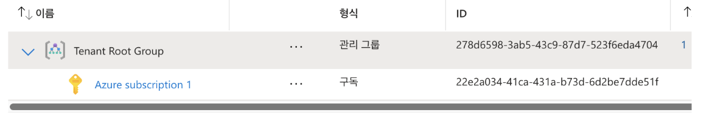

# 서버 작업 환경 설정

## 목차
- [서버 작업 환경 설정](#서버-작업-환경-설정)
  - [목차](#목차)
  - [Azure 구독(무료 평가판)](#azure-구독무료-평가판)
  - [Azure 구독(유료 서비스)](#azure-구독유료-서비스)
  - [리소스 프로바이더 등록](#리소스-프로바이더-등록)
  - [Azure CLI 설치 및 로그인(Windows Only)](#azure-cli-설치-및-로그인windows-only)
  - [Azure CLI 설치 및 로그인(Mac Only)](#azure-cli-설치-및-로그인mac-only)
  - [리소스 그룹 생성](#리소스-그룹-생성)
  - [기본 configuration 셋팅](#기본-configuration-셋팅)
  - [AKS/ACR 생성, 삭제](#aksacr-생성-삭제)

---

## Azure 구독(무료 평가판)
회원가입 후 Azure portal(https://portal.azure.com)에 로그인 합니다.

- 첫 페이지에서 [시작]버튼 클릭

  
- [Try Azure for free] 클릭 
무료 평가판은 일부 서비스에 한 해 200$까지 사용할 수 있는 Credit을 제공합니다. 
만약, 이미 사용했거나 바로 유료 구독을 하려면 [Pay as you go]를 클릭합니다.  


- ‘Agreement’의 체크 박스를 모두 체크하고 [Next]클릭

- Identity verification by phone
전화번호 입력(예: 821040954035)후 [Text Me]클릭. 
핸드폰으로 온 인증코드 6자리를 입력하여 본인확인

- Identity verification by Card
본인 카드 정보와 주소를 입력

| [Top](#목차) |

---

## Azure 구독(유료 서비스)
AKS를 사용하기 위해서는 유료서비스까지 구독해야 합니다. 
첫페이지에서 [시작]을 누른 후 다음 페이지에서 [Pay as you go]를 클릭합니다. 

Agreement, Card 정보 제공 후, ‘Add technical support’에서 마지막 옵션을 선택합니다.
만약 유료 기술 지원 서비스를 받으려면 다른 옵션을 선택합니다.  


| [Top](#목차) |

---

## 리소스 프로바이더 등록
VM, CPU, 메모리와 같은 리소스를 사용하기 위해 리소스 프로파이더를 등록해야 합니다. 
 
‘구독’서비스를 찾아 클릭합니다. 


구독 이름을 클릭합니다.


리소스 프로바이더를 등록합니다.
‘compute’로 필터링한 후 ‘Microsoft.Compute’를 선택하고 상단의 [등록]버튼을 클릭


‘Microsoft.Compute’의 상태가 ‘Registered’가 될때까지 기다립니다. 약 3~4분 걸립니다. 

완료 후 ‘사용량 및 할당량’ 메뉴를 클릭하면 리소스 사용 현황과 할당량이 나타납니다. 


'Microsoft.ContainerService'를 등록합니다.  
  

| [Top](#목차) |

---

## Azure CLI 설치 및 로그인(Windows Only)
Window사용자는 MobaXTerm을 사용하여 로컬 Ubuntu에서 작업 합니다.   

- 로컬 Ubuntu 로그인(Windows Only) 
  MobaXTerm을 실행하고 작성한 WSL세션을 클릭하여 로그인합니다.  
  **이후 작업은 모두 로컬 ubuntu에서 수행**합니다.  

- azure CLI 설치
  ```
  # 1. Microsoft 서명 키 추가
  curl -sL https://packages.microsoft.com/keys/microsoft.asc | gpg --dearmor | sudo tee /etc/apt/trusted.gpg.d/microsoft.gpg > /dev/null

  # 2. Azure CLI 저장소 추가
  AZ_REPO=$(lsb_release -cs)
  echo "deb [arch=amd64] https://packages.microsoft.com/repos/azure-cli/ $AZ_REPO main" | sudo tee /etc/apt/sources.list.d/azure-cli.list

  # 3. 패키지 리스트 업데이트 및 설치
  sudo apt-get update
  sudo apt-get install azure-cli
  ```

- azure Login:   
  명령 수행 후 나오는 url을 브라우저에서 열고 제시된 코드를 넣어 로그인.  
  ```
  ubuntu@DESKTOP-PJ5MG3E:~$ az login --use-device-code
  To sign in, use a web browser to open the page https://microsoft.com/devicelogin and enter the code NVEJDG9JD to authenticate.
  ```


| [Top](#목차) |

---

## Azure CLI 설치 및 로그인(Mac Only)
로컬 터미널을 열어 작업합니다.  

Azure CLI 설치
```
https://learn.microsoft.com/ko-kr/cli/azure/install-azure-cli
```

Azure CLI 로그인
```
az login
```

※ Troubleshooting
아래 예와 같은 에러 메시지가 나오면 tenant id를 이용하여 로그인 합니다. 
복수ID를 사용하는 경우는 각 ID별 tenant가 달라 생기는 오류입니다. 
```
Retrieving tenants and subscriptions for the selection...
Authentication failed against tenant 278d6598-3ab5-43c9-87d7-523f6eda4704 'Default Directory': AADSTS50076: Due to a configuration change made by your administrator, or because you moved to a new location, you must use multi-factor authentication to access '797f4846-ba00-4fd7-ba43-dac1f8f63013'. Trace ID: 919a4b59-da35-4227-aae5-d14b761d6600 Correlation ID: d471e8f4-1edc-4942-a044-b627e8c7aa60 Timestamp: 2025-01-30 07:39:05Z
If you need to access subscriptions in the following tenants, please use `az login --tenant TENANT_ID`.
278d6598-3ab5-43c9-87d7-523f6eda4704 'Default Directory'
No subscriptions found for unicorn.agile.ai@gmail.com.
```

‘관리 그룹’서비스를 찾아 Tenant ID를 확인합니다. 


아래와 같이 tenant옵션을 이용하여 로그인 합니다. 
다음 로그인 시 동일 tenant 라면 ‘tenant’옵션 없이 로그인할 수 있습니다. 
```
az login --tenant {tenant id}
```

| [Top](#목차) |

---

## 리소스 그룹 생성 
1. 리소스 그룹 생성  
리소스 그룹을 생성합니다. 
  
  

※ 참조: 리소스 그룹 생성 (CLI 이용)
  ```
  az group create --name unicorn-rg --location koreacentral
  ```

2. 참조 명령어  
사용 가능한 리소스 그룹 조회
- 모든 리소스 그룹 조회
  ```
  az group list --output table
  ```

- 특정 키워드로 리소스 그룹 검색 (예: 'dev' 포함된 리소스 그룹)
  ```
  az group list --query "[?contains(name, 'dev')]" --output table
  ```

- 특정 위치의 리소스 그룹 검색 (예: koreacentral)
  ```
  az group list --query "[?location=='koreacentral']" --output table
  ```

- 본인의 권한 확인
  ```
  # 리소스 그룹의 액세스 제어(IAM) 정보 확인
  az role assignment list --resource-group $MYRG --output table

  # 특정 리소스 그룹에 대한 본인의 역할 확인: Principal은 위 명령 결과값 참조 
  az role assignment list --assignee {Principal} --resource-group $MYRG --output table
  ```

- 리소스 그룹 내 기존 리소스 확인
  ```
  # 리소스 그룹 내 모든 리소스 조회
  az resource list --resource-group $MYRG --output table

  # 리소스 유형별 필터링 (예: App Service만 조회)
  az resource list --resource-group $MYRG --query "[?type=='Microsoft.Web/sites']" --output table

  # 태그별 필터링 (예: 'environment=development' 태그가 있는 리소스)
  az resource list --resource-group $MYRG --query "[?tags.environment=='development']" --output table
  ```

| [Top](#목차) |

---

## 기본 configuration 셋팅
명령어에서 반복적으로 사용할 Resource Group과 Location값을 기본 설정에 셋팅합니다.   
```
az configure -d group={리소스그룹} location={Location}
```
예시)
```
az configure -d group=tiu-dgga-rg location=koreacentral
```

설정된 값을 확인합니다.
```
az configure -l -o table
```

| [Top](#목차) |

---

## AKS/ACR 생성, 삭제
AKS/ACR의 Naming rule은 아래와 같습니다.  
- userid: dg{차수 2자리}{일련번호 2자리}. 예) dg0101    
- 개인별 학습 시: {userid}-aks, {userid}cr. 예) dg0101-aks, dg0101cr  
- 팀별 MVP개발 시: {teamid}-aks, {teamid}cr. 예) lego-aks, legocr   

> 본 가이드는 dg0100을 userid로 사용하여 설명합니다.  
  
1. AKS
- AKS 클러스터 생성
  ```
  az aks create [-g {리소스그룹} -l {location}] \
  -n {AKS명} \
  -c {노드수} \
  --min-count {노드 최소수} \
  --max-count {노드 최대수} \
  -s {VM Size type} \
  --node-osdisk-type {Managed or Ephemeral} \
  --node-osdisk-size {각 노드 내부 Disk size} \
  --enable-cluster-autoscaler \
  --generate-ssh-keys
  ```
  
  > Tip: **VM Size type 보기** 
  > ```
  > https://portal.azure.com/#view/Microsoft_Azure_Compute/SpecPickerV2Blade/subscriptionId/22e2a034-41ca-431a-b73d-6d2be7dde51f/regionId/koreacentral/hideCost~/false/specFiltering~/%7B%22disabledSpecs%22%3A%5B%5D%2C%22platform%22%3A%22Linux%22%2C%22hideDiskTypeFilter%22%3Afalse%2C%22zone%22%3A%5B%5D%2C%22minMemoryGB%22%3A4%2C%22minvCPUs%22%3A2%2C%22securityType%22%3A%22AllowAll%22%7D
  > ```
  > [도움말](https://learn.microsoft.com/ko-kr/azure/virtual-machines/sizes/overview?tabs=breakdownseries%2Cgeneralsizelist%2Ccomputesizelist%2Cmemorysizelist%2Cstoragesizelist%2Cgpusizelist%2Cfpgasizelist%2Chpcsizelist)
  > 제일 많이 사용하는 VM Size type(마지막 컬럼의 비용은 월 사용비용임)  
  > **교육시에는 'Standard_B2s'를 사용하고 MVP개발시에는 'Standard_DS3_V2' 사용**   
  >   

  > Tip: **node-osdisk-type**  
  > Managed: 영구 Disk에 저장, Ephemeral: 임시 OS Disk에 저장  
  > Ephemeral 타입으로 지정하면 속도는 빨라지나 영구 Disk에 저장하지 않은 데이터(예: 로그, 컨테이너 이미지)는 재시작 시 삭제됨  
  > Ephemeral 타입으로 지정하려면 node의 최대 캐시 사이즈가 OS Disk크기보다 더 커야함.  
  > node의 최대 캐시 사이즈는 VM Size type에 따라 지정되므로, 더 고비용의 VM size type을 사용해야 할 수도 있음.   
  
  예시)  
  ```
  az aks create \
  -n dg0100-aks \
  -c 2 \
  --min-count 2 \
  --max-count 10 \
  -s Standard_B2s \
  --node-osdisk-type Managed \
  --node-osdisk-size 200 \
  --enable-cluster-autoscaler \
  --generate-ssh-keys
  ```

- AKS Credention 구하기  
  ```
  az aks get-credentials [-g {리소스그룹}] -n {AKS명} -f ~/.kube/config
  ```
  예시)
  ```
  az aks get-credentials -n dg0100-aks -f ~/.kube/config
  ```

- AKS 클러스터 삭제  
  ```
  az aks delete [-g {리소스그룹}] -n {AKS명} --yes
  ```
  예시)
  ```
  az aks delete -n dg0100-aks --yes
  ```

- ACR 생성
  이미 존재하는 ACR인지 체크  
  ```
  az acr check-name -n [-g {리소스그룹}] -n {ACR명}
  ```
  예시)
  ```
  az acr check-name -n dg0100cr
  ```

  ```
  az acr create [-g {리소스그룹}] -n {ACR명} --sku Basic --admin-enabled true
  ```
  > 주의: ACR명에는 대시나 언더바와 같은 특수기호를 사용할 수 없고 영문소문자와 숫자만 가능합니다.   

  예시)
  ```
  az acr create -n dg0100cr --sku Basic --admin-enabled true
  ```

- ACR 삭제
  ```
  az acr delete [-g {리소스그룹}] -n {ACR명}
  ```
  예시)
  ```
  az acr delete -n dg0100cr --yes
  ```

- AKS에 ACR의 image pulling 권한 등록
  AKS에서 ACR에 접근하여 컨테이너 이미지를 pulling할 수 있도록 AKS의 managed identity에 ACR에 대한 AcrPull 역할을 할당
  ```
  ACR_ID=$(az acr show -g {리소스그룹} -n {ACR명} --query "id" -o tsv)
  echo $ACR_ID
  az aks update [-g {리소스그룹}] -n {AKS명} --attach-acr $ACR_ID
  ```

  예시)
  ```
  ACR_ID=$(az acr show -n dg0100cr --query "id" -o tsv)
  echo $ACR_ID
  az aks update -n dg0100-aks --attach-acr $ACR_ID
  ```

| [Top](#목차) |

